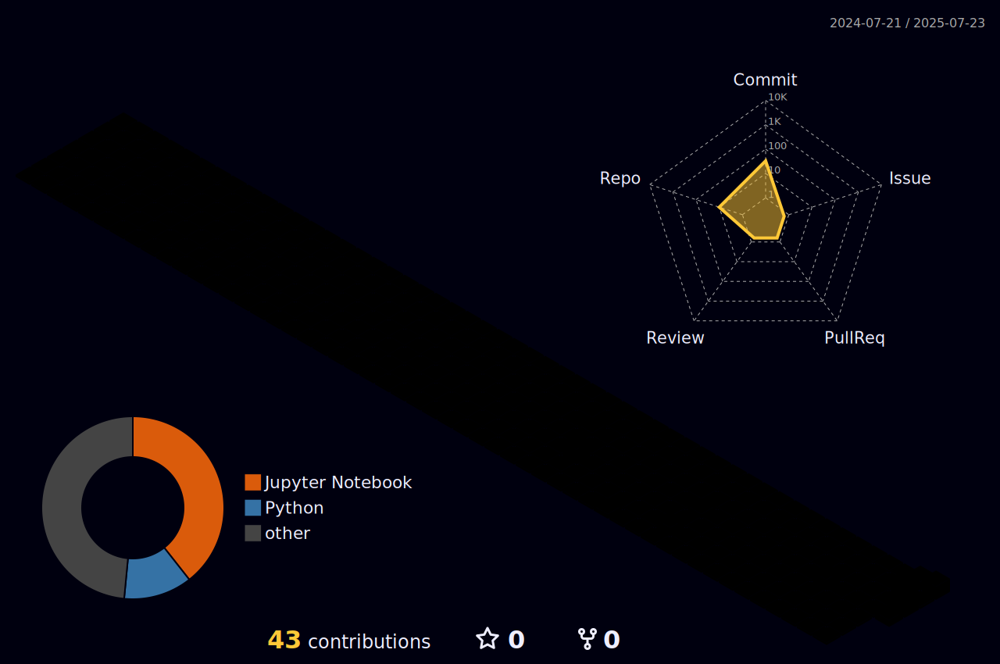

<h1>  Hello World! </h1>

## &nbsp;***About Me***

-   I am an **AI/ML Engineer** with a passion for building intelligent systems and solving complex problems.
-   My core interest lies deep within the field of Artificial Intelligence, and I am actively seeking opportunities to contribute to meaningful projects in this domain.
-   Currently, I am expanding my skill set by learning **DevOps** to better understand the entire lifecycle of model development and deployment.
-   👯 I’m always looking forward to collaborating on innovative open-source projects, especially in the AI/ML space.
-   ✔ Ask me anything, I am happy to help and learn together!

### <h3> 💻 Tech-Stack </h3>

## 🔗 Contact Me

## 📊 Github Analytics

  

